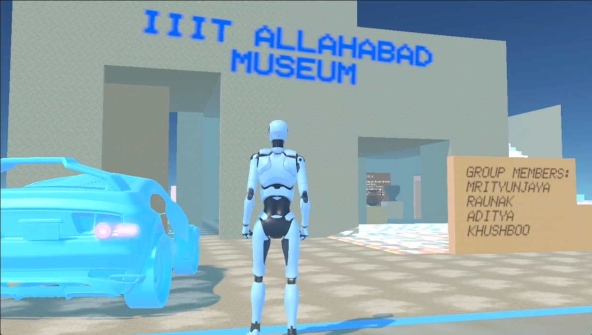
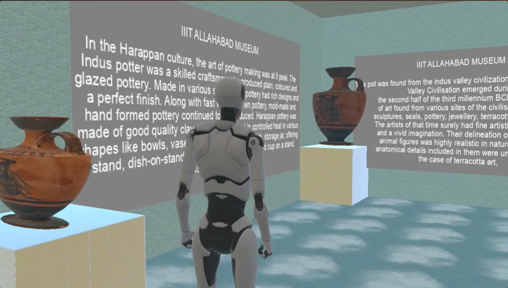
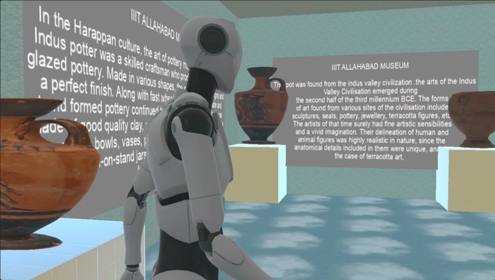
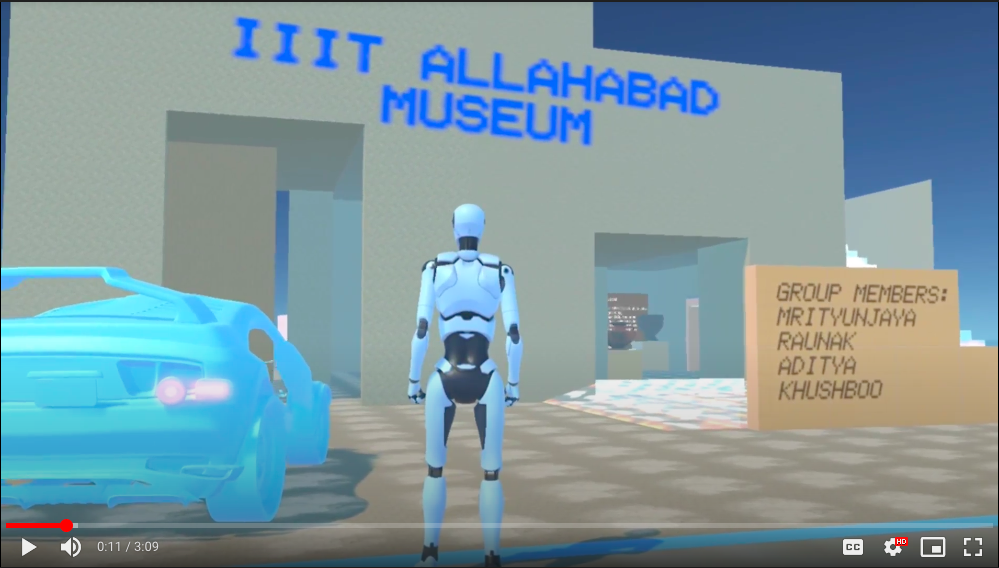

## Virtual Museum
#### AGA Course Project
Uder supervision of Prof. Anupam Agarwaal
<hr>

<!-- TABLE OF CONTENTS -->
<details open="open">
  <summary>Table of Contents</summary>
  <ol>
    <li>
      <a href="#about-the-project">About The Project</a>
    </li>
    <li><a href="#built-with">Built With</a></li>
    <li>
      <a href="#getting-started">Getting Started</a>
      <ul>
        <li><a href="#prerequisites">Prerequisites</a></li>
        <li><a href="#installation">Installation</a></li>
      </ul>
    </li>
    <li><a href="#how-to-use">How to use</a></li>
    <ul>
        <li><a href="#iiit-allahabad-virtual-museum-outside-look">Museum outer look</a></li>
        <li><a href="#interactions-of-artifacts-with-avtar">Interfaction with artifacts by Virtual Avtar</a></li>
      </ul>
     <li><a href="#demo-video">Demo Video</a></li>
     <li><a href="#team-members">Team Members</a></li>
     <li><a href="#important-project-links">Important Project Links</a></li>
    <li><a href="#acknowledgements">Acknowledgements</a></li>
  </ol>
</details>
<hr>

## About The Project
A virtual museum is a digital entity that draws on the characteristics of a museum, in order to complement, enhance, or augment the museum experience through personalization, interactivity and richness of content.

<hr>

## Built With
<ul>
   <li>Unity3D</li>
   <li>Blender</li>
   <li>Google Script</li>
  <li>Javascript</li>
</ul>

<hr>

<!-- GETTING STARTED -->
## Getting Started

This is an example of how you may give instructions on setting up your project locally.
To get a local copy up and running follow these simple example steps.

### Prerequisites 

This is an example of how to list things you need to use the software and how to install them.
  * Software: UNITY 3D
  * Unity 3d editor (Prefer 2020.3.30f1 LTS)

 ### Installation

1. Clone the repo
   ```sh
   git clone https://github.com/Error404m/Virtual_Museum
   ```
2. Change directory to main file
   ```sh
   cd Virtual_Museum
   ```
3. Install Unity3d
   ```sh
   install Unity hub and thier unity3d editor enviornment (prefer 2020.3.30f1 LTS).
   ```
4. Setup the Unity3D software and open.
5. Go to File
6. Open Projec
7. Then, browse to where that project is located
8. Select that project. Then, open it.
9. Tap on Build and run.
10. Wohoooo, Project is live .
 

<hr>

<!-- Usage -->
### How to use
Now use keys for navigating the Avtar.

1. Left Move
   ```sh
   Use "A" or "left arrow key" for left turn.
   ```
2. Right Move
   ```sh
    Use "D" or "right arrow key" for right turn
   ```
3. Forward move
   ```sh
   Use "W" or "up arrow key" for forward move
   ```
4. Backward move
   ```sh
   Use "S" or "down arrow key" for backward move
   ```
5. Scene movement (Upside)
   ```sh
   use E key for down side movement.
   ```
6. Scene movement (Upside)
   ```sh
   use Q key for down side movement.
    ```
7. Jump
   ```sh
   use space key for Avtar jump.
   ```
   
### IIIT Allahabad Virtual Museum outside look
This is the view from outside of virtual museum .  Now navigate Avtar by pressing "D" or "right arrow key" for left turn , "A" or left arrow key for left turn. W or UP KEY for move forward, S or Down key for back movement, and space key for jump .
<br><br> 

### Interactions of Artifacts with Avtar
Artifacts are set up minimum and maximum threshold values , whenever Avtar will come in range of minimum threshold value, It automatically starts speaking and vice versa when Avtar will be away from maximum threshold range ,then audio demonstartion will be stopped .
<br><br> 
<!-- <br>  -->

<!-- Usage -->
<hr>

## Demo Video
[](https://drive.google.com/file/d/1D_P6y_Q1rS1wJEiU-l4j0-WtrBpyqF4m/view?usp=sharing)

<hr>

<!-- Acknowledgements -->
## Team Members  
   
| Profile | Name | Enrollment Number | 
| :-------------: | :-------------: | ------------- |
|  | Mrityunjaya Tiwari| IIT2019239 
|  | Raunak Singh Rathore| IIT2019222
| | ADITYA GUPTA| MIT2021006  
|  | Khushbooooo Mam| MIT2021045

<hr>

<!-- Important Project Links -->
## Important Project Links
* [Website Frontend (only for demo) ](https://error404m.github.io/Virtual_Museum/)
* [Report Docs](https://error404m.github.io/Virtual_Museum/)
* [PPT Presentation](https://error404m.github.io/Virtual_Museum/)
